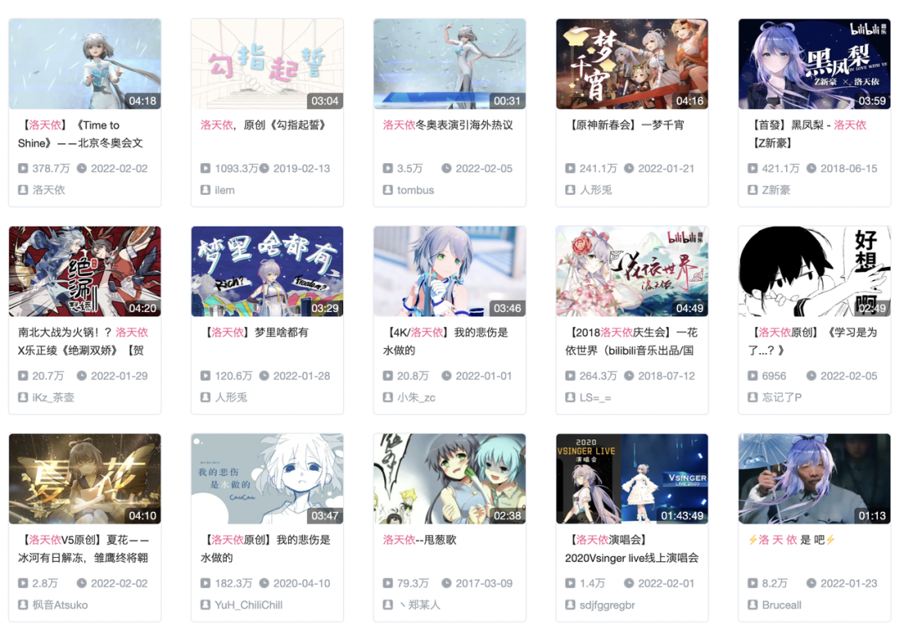
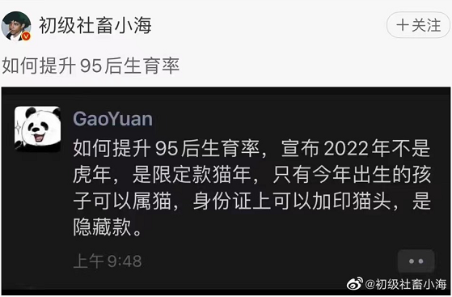

如果说虚拟偶像在这两年的兴起和现实偶像塌房有关的话，那么虚拟宠物的兴起背后也有不得不放弃养真实宠物的社会背景。

如果要评选最近一年热度最高的商业关键词，那么能够给“元宇宙”带来挑战的，大概就只有“虚拟人”了。

从清华大学的人工智能模型“华智冰”，到内容电商领域的虚拟人“AYAYI”，再到万科年度最佳员工“崔筱盼”，笑果文化还推出了虚拟脱口秀演员“梅涩甜”，无论是否“硬科技”“高新”“Z世代”，几乎各行各业都在想方设法地通过推出自己的“虚拟人”来怒刷存在感。

甚至就连“元宇宙”都在倒贴。

比如去年12月，东北证券发布的一份传媒板块研报，研究员就在第51页将乐华推出的、脱胎自饭圈经济里“偶像塌房现象”的虚拟偶像团体“A-Soul”列为了“元宇宙投资案例”——只有A-Soul的粉丝们对这个观点持“质疑”态度，他们在知乎上的发问“A-Soul和元宇宙有什么关系，为什么成了元宇宙投资案例”，浏览量勉强超过2000，并且很快有人给出了标准答案：

“元宇宙分物理宇宙和虚拟宇宙两个概念，虚拟宇宙里，就包括虚拟的一切”。

（然后发起了嘲讽）

年初爆火“啫喱”进一步锤实了“元宇宙本质上是虚拟人经济”这件事。行业媒体们在讨论“啫喱有没有抢到元宇宙门票”“啫喱是不是元宇宙社交”，用户之间的裂变传播则是交给捏脸来完成的，开屏海报上也直白地写着“潮流穿搭”。

然而“虚拟人”是有天然BUG的，市场并没有按照资本的设想照单全收。尤其是对于“虚拟人”理论上的核心受众“年轻人”来说，一方面，与虚拟偶像挂钩的“元宇宙”在年轻人中已经成为近乎段子一样的存在，另一方面，虚拟偶像目前所能实现的行为与交互实在太少，企业们如此看重数字人，让本就面临工作压力的年轻人多少有些心寒。

以前喜欢初音未来、洛天依还能解解压，现在怎么虚拟偶像都来抢自己工作了？

更现实的状况是，对企业来说，虚拟人除了作为发展新技术的决心外，还远不具备革新商业模式的能力，而对文化产业中的虚拟偶像来说，“中之人”的风险也成为悬在“塌房”头顶的达摩克利斯之剑。怎么看“虚拟人”都不像风口的最佳选择，“人”这个因素的存在很容易把消费者们推进商业的“恐怖谷”里。

相比之下，如果我们真的要掀起一波“虚拟宇宙”空间里的“虚拟新基建”的话，“虚拟宠物”看起来更适合把年轻人引进来。从古早时期的拓麻歌子，到后来的以太猫以太狗，虚拟宠物一直以来所拥有的特性，其实就是现在企业们想在元宇宙中所获得的。

### **虚拟偶像：虚拟经济尴尬的一端**

虚拟人可能出现的发展瓶颈，在虚拟偶像上得到了直观体现。作为“泛虚拟人”概念里最成熟的产品，虚拟偶像发展到今天号称可以自主完成“身为偶像练习生”的绝大部分日常行为，并且已经拥有了比较明确的定义和使用准则。

艾媒咨询将虚拟偶像应用领域分为了四大版块：食品餐饮领域、企业服务领域、快消品领域以及文娱产业领域。在这四个版块中，大众较为熟知的早期的初音未来、洛天依，还有当下最火的A- Soul女团属于文娱版块，其他领域的虚拟偶像则没有掀起太多浪花——既看不到企业是如何运营人设的，虚拟人们也并没有真正意义上完成“独立”工作。

总之，当下大多企业、服务领域的虚拟偶像的存在更像是在一个全新的技术领域内占坑，在保持行业存在感的同时，拓宽人们对虚拟人的接受程度。

（美的推出的两位很有虚拟偶像色彩的虚拟员工）

这种集体撒网虚拟偶像的现象折射出两个问题。

首先是企业自上而下运作的虚拟偶像偏离了虚拟偶像最初大热的原因，也就是内容共创。

在Vtuber之前的虚拟偶像——譬如初音未来、洛天依——都是运营方给出人设，绝大部分的内容都由粉丝创作而成。尽管现在对技术以及视觉呈现上惊艳的追求，虚拟偶像越来越多地和资本合作，登上电视舞台进行联动，但洛天依等虚拟偶像依旧拥有大量共创的内容。相反，为企业服务的虚拟偶像/数字人仅仅是告诉大众有这么回事之后便再无内容上的水花。

（洛天依在B站依旧拥有大量共创内容）

这也就导致了第二个问题——使用场景上的尴尬。通常认知中，虚拟偶像更多是日常生活中的消遣，譬如直播、粉丝创作并消费的二创内容，只有极少时刻才会在电视上的大舞台面对非核心群体。

但对于B端的虚拟偶像来说，邀请粉丝进行日常的内容共创是不现实的。来自企业的虚拟偶像本质上可以看做一名“市场部员工”，对于“市场部员工”来说创作内容不是目的而是手段，如果能有比“创作内容”更有效的“拉新促活”方法，市场部显然是愿意转向的。而如果没有长期的内容创作策略，虚拟偶像很难进一步在大众面前出现。

这种矛盾，让企业布局B端虚拟偶像至少在现在看来实在是一个蹭热点但不讨好的举措。

而相对于虚拟偶像发展较为成熟的文娱领域，也存在着一个矛盾：虚拟偶像是否真的可以“永不塌房”？这四个字甚至已经成为A-Soul出道时就携带的标语。

“塌房”这一饭圈术语指的是：爱豆由于谈恋爱或某些劣迹行为，导致人设崩塌，粉丝无法继续将情感投射在他们身上。这是饭圈经济里最有代表性的争议性话题，经典的辩论就是“ta”的存在基础是自然人还是商业包装后的产品（典型如王源抽烟、鹿晗与关晓彤官宣恋爱等等）？

从原理上看，虚拟偶像似乎可以避免这个陷阱，“ta”就算业务能力再怎么不行，也不会和真人一样去恋爱、有劣迹吧？

不过这只在理论上行得通。对V圈有过接触的都知道“中之人”实际上是虚拟偶像中的关键角色，它指的是虚拟偶像背后扮演虚拟偶像的现实人物，是实际上的直接内容创作者，为虚拟偶像的成色兜底下限。B站UP主“老蒋巨靠谱”就认为，V圈受众所喜欢的其实是虚拟偶像的虚拟外形与中之人逐渐融合的完整形象，譬如人设为cool guy的珈乐在中之人的扮演下逐渐呈现出软妹的一面，而这获得了更多的粉丝热爱。

然而，即便不去追究中之人的现实生活已经成为V圈的政治正确，当“中之人”发生意外状况时，粉丝的反应与饭圈塌房如出一辙。A-Soul的成员向晚就经历了中之人现实身份被发现后更换的风波（甚至被拿来玩梗）。

类似的事件不止一例。开头提到的清华大学首个数字学生“华智冰”，就在正式发布视频后被质疑原型或许只是来自B站UP主“鱼子酱酱”的一段原创视频，“华智冰”仅仅是一次换皮。

再往前推，中之人至少可以追溯到18世纪的“土耳其行棋傀儡”，一位奥地利的魔术师为了取悦女大公而制造了一台自动下棋装置，并战胜了许多贵族，最后被揭穿只是下棋高手躲在机器里下棋的骗局。换句话来说，虚拟偶像并不是真的虚拟。

通过上面的分析可以看出，虚拟偶像除了企业表达入局元宇宙的决心之外，似乎并不是一个最好的选择，它缺乏清晰的产业定位，没有大众共创的内容，支撑“永不塌房”的是随时可能被打破的隐私边界——只不过是在饭圈逻辑之上加了一层道德约束罢了，不少虚拟人甚至没有怎么被大众看见过。

### **虚拟宠物：具备可能性的另一端**

在想象虚拟宠物的市场前景之前，我们先来看这样一张梗图。

这张图暗含了两个关键的信息：第一，作为百兽之王的老虎居然需要以“猫”的形象重新获得热度——今年大火的“猛虎下山”表情包就是典型案例，这组表情包的基础出发点就是将老虎形象以猫的逻辑萌化来获得更多青睐；第二，猫以虚拟形象与身份证伴随在一起会获得更多年轻人的喜爱。

而且，高赞评论中有几条都认为，是孩子的身份证加猫头又不是自己的，那为什么要生？另一种评论认为还是要养孩子，为什么不直接养猫？

这是一个缩影，当下年轻人对宠物的包容度远大于人，对生孩子、结婚、复杂人际关系恐惧的年轻人，更愿意成为“铲屎官”。艾媒咨询的数据显示，2021年中国单身人群中养宠物的占58.4%，非单身群体中养宠物的比例为26.3%。

由宠物出发的陪伴情感显然非常值得挖掘，宠物的虚拟化则更有意思。

以猫为例，猫在古代就因为能保护书籍不被老鼠啃食而进入读书人的家庭，久而久之也就有了一种陪伴式的情感，宋代诗人陆游曾写过的“溪柴火软蛮毡暖，我与狸奴不出门”就体现出猫的陪伴性特征。而到了现代社会后，有学者认为猫的情感寄托功能就更具有结构化的色彩：独居现象日益加重、青年人在城市中缺少亲密关系，只能将情感寄托于猫上，也就是这样才有了猫咖、猫类表情包等的爆火。

如果说虚拟偶像在这两年的兴起和现实偶像塌房有关的话，那么虚拟宠物的兴起背后也有不得不放弃养真实宠物的社会背景。

虚拟宠物可以追溯至1996年的万代公司制作的拓麻歌子（Tamagotchi），也就是电子鸡。彼时日本政策规定不得在办公室与公寓养宠物，另一方面，日本的住宅相对较小，并没有太多的空间来饲养宠物，因此设计者之一真板亚纪便萌生了制作一个虚拟宠物的想法。

这也就意味着，虚拟宠物的设计从一开始就是充当宠物的替代品，为了缓解现代人的精神压力、平衡情感需求与有限的生活成本而设计。

拓麻歌子的技术并不复杂，只有四个按钮进行喂食、睡眠、吃药、清理粪便等八种交互操作，由一块单片机即可完成主要程序。因此2000年前后传入中国后，出现了大量十几块钱的仿制品在学校门口售卖（专柜价从一百到三百不等）的现象，间接地促进了虚拟宠物的受众人群扩大：从上班族发展到了小学生。

（拓麻歌子的技术交互模型，图源《电子制作》）

只是当时移动通讯设备发展还属于起步阶段，人们通过电子设备进行娱乐的方式近乎等于零，“虚拟宠物”在这种陌生的环境下一度被当成过“洪水猛兽”，人们对拓麻歌子的讨论更多是这个“玩具”是否会影响孩子们的学习。譬如那时的泰国教育部长曾签署命令，要求全国受教育部管辖的学校禁止携带电子宠物进入学校。甚至在不少地方都出现了托管电子宠物的第三方中介。

值得一提的是，在主要面向女生的拓麻歌子之外，万代还推出过“数码暴龙机”这种具有对战元素的虚拟宠物机来打开男性市场，其最著名的周边产品动漫《数码宝贝》在00年代初引进中国，得到了巨大的好评，那时的孩子们可以在暑期看完一部完整的数码宝贝。这也为不久后的拓麻歌子与数码暴龙兽在中国的引进埋下伏笔。

按照时间线来计算，这群手握着数码暴龙机对战的孩子们长大以后，生活方式又悄然地与“拓麻歌子”诞生的背景相重合，自然而然地成为类似旅行青蛙这样的养成陪伴系游戏的第一批消费者。

智能手机的普及进一步推动了中国消费者们对虚拟宠物的认可。

2010年前后，随着4G的全面普及，智能手机开始成为年轻人生活的刚需，大量之前需要靠独立电子设备来实现的创意在智能手机的帮助下，得到了低成本的实现机会，“虚拟宠物”就是其中的最大受益者之一。少数派就曾指出，本来面向孩子的应用“会说话的汤姆猫”——这款几乎是最早在智能手机上呈现的虚拟宠物——就因为智能手机的缘故同样吸引了大量成年人。

而另一方面，社会压力的增大也让中国的青年群体有了情感寄托的需求，这种以陪伴为主打的游戏往往具有游戏模式简单、不强调使用时间、以收集养成而非对战为特点，就像执掌任天堂52年的山内溥（1927-2013）总结的“收集、养成、交换、追加”的黄金口诀那样。上面提到的陪伴式虚拟宠物旅行青蛙就是这类游戏的典型，同类型的还有猫咪后院，至今还依然有网友带上青蛙实物玩偶前往实景地进行打卡。

当然，如果只说具有陪伴感的话，另一种被中介过的宠物体验也具有相当程度的情感陪伴功能——云养宠物。

巨量算数的数据显示，2021年抖音“猫”“狗”话题相关的视频总播放量均超过3000亿。对于大部分内容消费者而言，这样规模巨大的内容显然有助于自己的情绪宣泄。

然而，这种热情对内容的生产者却是一个问题，因为他们需要思考如何在宠物视频中形成自己的IP并持续内容输出，久而久之消费者们看到的却又还是另一种背后有着“中之人”思维的宠物视频，也面临塌房风险。

微博知名博主“回忆专用小马甲”就曾经历对宠物的过度消耗——对宠物进行摆拍、推荐宠物绝育但让自己的宠物繁育等行为——而引起的巨大争议。

（宠物博主塌房对消费者有着类似作用，来自知乎“Evelyn”）

这样看来，云养宠物的逻辑其实是“获得宠物带来的心理陪伴-现实养宠物的麻烦+承担博主塌房的风险”，而过去大火现在呈现复兴态势的虚拟宠物的逻辑则可以归纳为“获得宠物带来的心理陪伴-现实养宠物的麻烦+现实宠物不会拥有的随机性”。

比如刚才提到的旅行青蛙就具有这种随机性。游戏中玩家为“蛙儿子”准备不同的食物将触发不同的旅行时间（野菜三明治对应匆忙离开，山蒜馅饼对应早点回家，南瓜百吉饼对应长途旅行……）不同的道具组合也会产生不同的旅行目的地，不同的来访好友喜欢不同的礼物等等。这种陪伴养成系的游戏攻略一定程度上就是在破解这种体验的随机性。

当然，这种攻略是否违背了游戏的初心，以及攻略是否能穷尽事件触发的条件，就是另一个问题了。

（小红书上就有大量关于旅行青蛙的攻略合集）

也并不只是现在的养成游戏才有这种随机性。最早的拓麻歌子表面上看最近的新品只是在迎合IP，但其实也在拓宽养成随机性的玩法。譬如最早的拓麻歌子的设定就是，对宠物饲养的方式不同将会影响宠物最终的外观，而在近年推出的与EVA的联名款中，据知乎答主“一山同学”称，可以养成20多种使徒——高于TV设定的18种，甚至可以养出男主的父亲碇源堂。拓麻歌子与动漫《鬼灭之刃》的联名款中，最终也可以养出九种不同的形态，并且会随机偶遇“鬼”与之战斗。

如果将这种随机性向前拓展，那么虚拟宠物毫无疑问将成为元宇宙这个空虚的概念中一个最有可能落实的版块。
![3f056f989c21be76da735d858d984c13](3f056f989c21be76da735d858d984c13.png）

### **虚拟宠物的未来是什么？**

在元宇宙的概念提出以前，就已经有一种个性化、随机化的虚拟宠物被人们所知，就是“加密猫（Crypto Kitties）”。

这是一种基于区块链或者NFT（不可替代令牌）技术制作出的游戏。据电脑报的介绍，在游戏的初始阶段，游戏的开发者销售出100个创世猫，同时每隔15分钟还有一个0代猫诞生可以用于买卖。游戏中每只猫的长相均不相同，且基因可以遗传给下一代，两只电脑猫的交配生出的孩子会遗传到各自的256个基因组，影响外观、个性特征等，总计有40亿种变化的可能。每只加密猫都是唯一的并由用户拥有。

这种具有极强的随机性和个性化体验的游戏从特点上来说是符合元宇宙的基本特征的，即人们拥有一无二的专属体验，并且随机的数据库足够大。

然而，“加密猫”与虚拟宠物的接轨弊端就在于它依旧在以金融价值与稀有性来评判电子宠物的。在加密猫中，配种越多次和越晚世代出生的小猫的生育率会下降，越接近第0代或外观越独特的猫越贵。

这意味着，游戏中没有一个属于自己的价值衡量标准，通用的依旧为虚拟宠物的经济价值，而宠物本真的陪伴并没有被突出。区块链所号称的去中心化也依旧是在经济这一中心下运行的，个人对猫的专属价值是第二位的。

同时也就意味着，加密猫的玩法也与大部分区块链技术的游戏类似，本质上依旧是以货币交易为基础的游戏，这种对金融价值的强调其实也一定程度上背离了随机性与陪伴感这一宠物游戏内核。

AR技术的兴起也带来了另一种随机与专属的可能性。2016年大火的由Niantic制作的AR游戏精灵宝可梦就是宠物与AR技术连接起来的开端，游戏可以通过将虚拟站点与虚拟宠物放置在现实位置中，这种虚拟和现实的结合带来的随机性在于，玩家可以在一个经过的随机地点捕获到随机的口袋妖怪。

2019年谷歌也在搜索引擎中推出了AR动物功能。用户在搜索引擎中搜索动物即可打开AR卡，通过3D与AR查看动物与现实空间之间的互动。甚至还会出现原始动物这种不可能在现实中看见的生物也可以通过AR技术与现实空间进行互动。

不过目前出现的AR技术局限在于没有办法自定义自己想看到的宠物形象，消费者们所看到的形象由平台所决定。但能在随机的物理空间进行随机的动物搜索已经具有一定现实虚拟融合的雏形。

所以回到开头，大家关注的元宇宙完全可以结合目前应有的一些既有特点来进行虚拟宠物未来的发展。一方面，当下元宇宙规划中所展现出来的随机性、个性化以及现实与虚拟结合的特点已经在既有的虚拟宠物产品中有所呈现：拓麻歌子的个性化形象生成、旅行青蛙、AR虚拟动物的高度随机性等已经存在。另一方面，目前作为元宇宙落地较为被大众所熟知的虚拟偶像内核并没有体现出元宇宙的特点，它既不完全是虚拟的，也缺乏长久且不会破灭的伴随感。

只是话又说回来，元宇宙这个概念发展到现在也只是具有一些碎片化的特点，这些特点本就存在于人们现有的大多数场景中，譬如尹烨博士在《圆桌派新春派》中评论的那样：“我玩游戏的我什么没见过，大富翁也是元宇宙。”