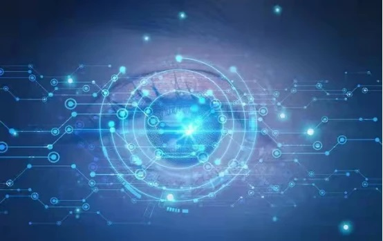

2021年，“元宇宙”的概念横空出世，引起了国内外大量人员的思索与讨论。“元宇宙”一词最早出现在史蒂芬森的科幻小说《雪崩》当中，但是现在对于元宇宙的构想已远远不是书中所描写的那样。根据大家普遍的观点，元宇宙是一个平行于现实世界的虚拟世界，是一个数字化的世界。那么元宇宙的本质是什么，不同学者提出不同的想法，其中我比较认同华大集团CEO尹烨的观点，元宇宙的本质是链接。

根据尹烨的观点，元宇宙从根本上讲讨论的是一个连接的问题，它促使人与人之间的距离变得更近了。元宇宙创造了一个平行于现实世界的虚拟世界，在这个世界中人与人之间的联系加强。打个比方说，通过元宇宙，两个人之间可以面对面的交流，虽然可能只是两个数字孪生体，但真实感极强，这就是所谓的加强连接。

尹烨教授认为元宇宙讨论的是人类的连接问题，代表的是加强人类之间的联系，由此他向前推导的元宇宙的1.0版本和2.0版本。元宇宙1.0版本始于文字的出现和书信的发明，通过驿站，镖局来传递信息，人与人之间的联系相较于之前变得更强；基于这个思路，元宇宙2.0是对元宇宙1.0的加强与升级，是基于电磁理论发展起来的，1844年，摩斯密码问世，大家可以通过电报来联系，这极大的加强了人们之间的联系，1865年，麦克斯韦发现了电磁波；1876年，贝尔实验室发明了电话；1920年第一台广播问世；1939年黑白电视问世；1954年彩色电视问世；1969年，阿帕网问世，就是我们现在互联网的前身；1984年，阿帕网正式改名因特网；1999年，中国互联网元年；2010年，移动互联网问世。基于元宇宙的本质是链接的思路以及对于科技史的回顾，上述的每一步都属于元宇宙的发展历程，那么我们现在所提出的元宇宙就是在以往的基础上的一个发展。

.jpg)

如果元宇宙的本质是链接，那么1895年卢米埃尔兄弟发明的电影也应该属于元宇宙2.0版本，同时基于卢米埃尔兄弟发明电影，拍摄并放映第一部电影《工厂大门》开始，元宇宙电影便随之诞生了。以此为依据，电影其实就是元宇宙的一部分，我们的电影从一开始就是元宇宙电影，或者说，电影自诞生之日起，就和元宇宙紧密相连，所谓的元宇宙电影，就是观众与电影中那个世界的联系。经过一路发展，电影经过了无声到有声的转变，黑白到彩色的转变，那翻看电影史，世界第一部有声电影1927年《爵士歌王》，中国第一部有声电影，1931年的《歌女红牡丹》；世界第一部彩色电影，1935年的《浮华世界》，中国的第一部彩色电影，1949年的《生死恨》，这两步是对电影元宇宙的初步加强，或者说是促进了电影元宇宙1.0的形成，彩色影像加声音，就构成了我们现在所说的视听语言；再往后发展，我们会发现一个节点，就是数字电影的出现，1968年，库布里克的科幻影片《2001太空漫游》问世；再往后，数字特效介入电影，1977乔治·卢卡斯拍摄的《星球大战》问世，和它配套的就是1975年第一家特效公司工业光魔的诞生，那么，这就是电影元宇宙2.0；再往后，2010年，卡梅隆的《阿凡达》上映，第一次在真IMAX技术上加上3D效果，这是全球第一次的，观众的观感又是不一样的，沉浸度会更高，与电影世界的连接度更高，由此电影元宇宙3.0诞生，并一直延续到现在。但这不是说现在仍是3.0版本，可能是3.5，3.6，不过没有到4.0版本而已。

4.0，5.0版本当前还未出现，因此我们需要畅想，但是畅想，我们需要确立一个基本观点，或者说是基本共识，要以数学和物理的真理为依据，综合考量各大学科的知识，建立科学展望不等于科幻的概念。首先我们说，元宇宙的本质是加强人与人之间的连接，引入电影，就是加强人与电影中那个世界的连接，那么我们就得思考，4.0版本的电影元宇宙是否还在影院当中，如果在影院当中，它的突破是什么？

对于这个问题，我的回答是影院无法完成突破，大银幕的存在限制了3.0向4.0的转变，这时候，我们需要转移我们的视线，看向AR，VR这些虚拟现实技术，现在这些是基本可以实现的，是能够给人一种身临其境的感觉。不过VR技术使用长久是有晕眩感的，以目前的技术看来，它能支撑一个多小时的使用。但是随着技术的加强，VR的使用时长是有望达成两个小时到三个小时。VR技术通过多年的发展，已经从几分钟到十几分钟再到一个多小时，如果按这个趋势发展下去，两个小时是大有希望的。为什么说两个小时呢？因为大部分电影都在两个小时左右或以内，如果基于上述思想，4.0版本的元宇宙电影就是基于VR技术的，但这只是第一步，由于VR技术本身的局限，元宇宙电影4.0将会有很大的限制，这其实和我们的人体神经构造有关。我们的内耳中有一个神经系统叫作前庭神经系统，当我们使用VR时，前庭神经系统和中枢神经系统接受的信号是不一致的，就是说我们的视觉神经接受到了一个非常逼真的世界，把他传输给中枢神经系统，那么我们的大脑就会产生我们就在这个世界的错觉，但是我们的身体是没有相应的反馈的，我们基本上是不动的，这时候前庭神经就会反馈，然后在大脑中就会产生两种不同的信号，这时候中枢神经就会判断我们中毒，然后我们就会产生晕眩，呕吐等症状。如果基于这个判断，元宇宙电影4.0就是一个过渡阶段的产物。

.jpg)

如果再往下推导，就是元宇宙电影5.0版本，因为个人的能力有限，再加上越往后推，需要的相关知识和想象力的要求会更高，而且会变得越来越抽象，难度也会越来越大，所以我仅推导到5.0版本。但实际情况可能不一样，因为元宇宙其实有特别多的阶段，我所推导的5.0可能包含的元宇宙跨度比较大。我所推导的元宇宙电影5.0版本，可以参考电影《头号玩家》那种形式，或者说是一篇星云奖的科幻小说《人人都爱查尔斯》那种形式，就是说人们有一套设备，这套设备可以供人五感的体验，那么这时候，我们的电影就不一定是视听语言了，可能就是“五感语言”了。基于“五感语言”，观影形式将会产生巨大的变化，电影院可能会取消，成为一种过去，居家电影成为一种可能的形式，人们观看电影将会使用属于自己的那套设备，在支付给版权方一定费用后，就可以通过设备观看电影，这个时候，就是元宇宙电影5.0的初级形态。但是初级形态的观众只是一个旁观者，如前文所述，元宇宙的本质是加强链接，那么终极形态的元宇宙电影观众将会成为电影的体验者，他们可以选择不同人物的视角去体验不同人物的经历，同时，基于便捷性选择，设备将会变得轻巧，甚至会通过脑电波或脑芯片等技术来实现，这时候的电影也将打破单一视角的模式，变为多人物视角，简单来讲，电影创作者将构建一个两个小时的世界，每一个主要人物在这两个小时内将会不断的行动，去做电影创作者设计好的事情，而观众将选择其中的一个人物，去体验这个人物的历程，这时候观众和人物是合二为一的，观众能够通过技术获得关于这个人物的思想、情感以及各种感觉，但观众也受到支配，他无法控制人物，只能体验人物，而这可能就是区别元宇宙游戏和元宇宙电影的一个依据。

“元宇宙”是一个新兴的概念，至今的发展尚不明确，我们现在能做的只是一个构想，它未来的发展仍需要大量科学技术人员的支持。不过我是很看好元宇宙的，我始终觉得元宇宙将会给电影产业带来一次变革，这个变革绝对不亚于声音和色彩给电影带来的变革。