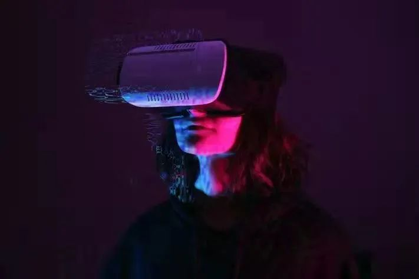

对于 “元宇宙” 的实际含义，目前很难正式达成一致的理解。该术语可以最好地描述为互联网的发展愿景，其中多感官增强功能，例如虚拟现实 (VR) 耳机，使用户能够像数字化身一样做工作、与朋友见面、购物和玩游戏。

目前这个阶段没有人可以确切地说出元宇宙是什么，或者它将是什么，它的存在大概率仍在进行中。元宇宙不会像互联网那样存在或不存在，经历了一段时间的发展才创建的互联网。因此，元宇宙可能是或多或少存在的下一代互联网。

和罗马一样，元宇宙不是一天建成的，但也不是因为不断的尝试。一年内，活跃的元宇宙用户数量增长了 10 倍，从大约 5000 名用户增加到 2021 年的 50000 多名，市场规模超过 5000 亿美元。到 2030 年，一个可广泛访问且与设备无关的虚拟世界可以承载一个拥有 50 亿用户和超过 8 万亿美元市场规模的数字世界。这些是对一个定义广泛的生态系统的大胆预测，其增长轨迹使其走上比互联网更大、更深入社会的道路。 

在元宇宙短暂的存在中，作为松散连接的区块链网络层与协议之间的竞争标准的元宇宙已有初步雏形。理想情况下，在开放的 Web3 基础设施上，治理和经济价值在用户之间共享，无需政府或监管机构的中央规划 —— 这就是元宇宙增长如此迅速的原因之一。 

元宇宙有很多规模经济等待发生。而且每一家大型科技公司都带着不同的动机和不同的 DNA。值得注意的是，在目前来看，加入元宇宙的成本可能不像过去新技术的成本那么高，因此丰富的可及性可能不会被所有人拒之门外。与元宇宙最显著的区别之一是增强现实设备的成本相对便宜。Facebook 的 Oculus Quest 2 VR 眼镜零售价为 300 美元，尽管该价格已得到该公司的补贴。 

大型科技公司正在构建自己的元宇宙版本，希望能在更大范围内连接全球各地的人们。Meta 的 Horizon Worlds 是一款免费的虚拟现实应用程序，与其 Oculus VR 眼镜相对应。Horizon Worlds 的虚拟世界包括比《动物穿越》等更令人身临其境的世界和游戏，但还远没有达到 Meta 所描述的最终希望实现的身临其境。 

目前，有传言称苹果正在开发一款 VR 头显，期望在虚拟世界的未来愿景中占有一席之地。微软和谷歌也在进入这个领域，希望在日益数字化的未来扩大他们的影响力。 

可以设想一下虚拟世界提出的技术需求的绝对规模：理论上无限数量的用户，在不断发展的虚拟空间中实时互动。即使是一个普通版本的元宇宙也将导致对芯片、网络能力和设备制造进步的需求激增。这意味着建立虚拟世界的元宇宙，可能会加速国家在实体世界中竞争。 

构建元宇宙将需要大量具体的硬件：Meta 已经构建了一台大型人工智能超级计算机，旨在以令人难以置信的规模处理数据。芯片制造商英伟达和 AMD 正在进行军备竞赛。（网络也是一个硬件问题：据悉苹果计划开发自己的调制解调器芯片，着眼于始终在线的增强现实技术。） 

但即使是最强大的假设半导体也可能不足以满足元宇宙行业的相关硬件诉求 —— 这意味着元宇宙最终可能会推动超越当今硬件战争极限的创新。 

但消费产品往往会推动强大的、有时是意想不到的创新：想想推动 5G 转型的对快速、无处不在的互联网访问的渴望。即使是创建虚拟世界的图形引擎，很大程度上也是过去几十年视频游戏硬件开发商争夺霸权的激烈竞争的产物。 

很难让 20 人同时参与到视频通话的平面 2D 环境中。有些人不喜欢出现在镜头前。元宇宙不是简单单纯地在模拟现实生活中的场景，这就是为什么公司正在转向基于 Metaverse 的平台。元宇宙也是关于社区建设、对话和互动的场景建设，希望在不久的将来可以应用到数字化身能够在制造世界和室内设计世界之间移动，协助人类工作。 

PixelMax 的虚拟工作场所允许员工在他们的数字办公室中走动并实时查看同事的化身，从而在他们的实体工作场所重现 “相互碰撞” 的体验。微软也有望进入新兴领域，并将利用其 Mesh 平台将化身和沉浸式空间融入到团队平台等协作环境中。 

在 Metaverse 上构建协作环境可以适用于各个行业。例如，不同地点的科学家可以使用技术来模拟原本在后勤上很艰巨的工作。高科技和软件公司可以部署混合现实平台，让远程同事能够更有效地构建、测试甚至销售数字产品。 

幸运的是，人们似乎是为这种转变已经做好了准备。联想的一项调查发现，近一半的受访者 44%的人准备在元宇宙工作；只有 20% 的人表示他们不愿意这样做。44% 的人还认为虚拟世界将提高他们的工作效率。 

越来越多商业场景开始采用元宇宙，可以让元宇宙创造出更多的机会。游戏化学习可以更容易和更快地获得技能。虚拟教练可以将面向客户的团队置于交互式的真实场景中，以磨练他们的客户参与能力。用于公用事业检查、现场服务和维护的支持 AR 的应用程序、眼镜或无人机可以将相关部件的物理视图与 “应该” 外观的 AR 视图叠加在一起 —— 所有这些都是为了提供更快的诊断、减少停机时间和支持员工安全。 

Metaverse 还可以帮助远程员工入职，并将其他人聚集在一起，以获得公司或部门范围内的学习和发展机会。元宇宙可以让人们在虚拟世界中反映物理世界，带来对话、培训、模拟和互动，其中几个人离开会议室可以在走廊上与类似的方式聊天交流，想想这是一件多么令人兴奋的事情。 

其他消费品牌将开设自己的虚拟商店，这些商店提供纯数字产品，消费者可以使用这些产品来装饰自己的虚拟住宅、办公室和空间。摩根大通等银行将为虚拟世界中的加密货币交易提供支持。高科技和软件参与者将开始提供区块链即服务、元宇宙即服务和 NFT 管理平台，允许组织盘点、审计和管理新资产或构建自己的内部区块链和元宇宙。 

元宇宙相关的新技术带来了改善客户体验的新机会。在银行业，沉浸式 VR 环境中的分支机构可以为虚拟世界中的客户提供更便捷、高度个性化的体验。在医疗保健领域，与通过电话购买这些服务相比，混合现实体验可以为精通技术的老年人提供更无缝的医疗保险购买和导航流程。 

在未来一到五年内，一些行业的虚拟世界具有一些或显著的商业价值。元宇宙将在商业中发挥作用。但这个角色将是什么，商业领袖可以在哪里抓住机会？在这个新生的、不断发展的和被过度炒作的空间中，细节可能很难掌握。 

就目前而言，元宇宙可能是未知的世界 —— 一个在建造过程中被发现的新世界。这将不仅仅是一个幻想的娱乐领域。它也可能是人们辅助学习成长、锻炼各类技能的地方。 

对于品牌而言，这将开辟新的收入来源和空间，以提升品牌亲和力。与现实世界一样，虚拟世界中的消费者将愿意为符合其价值观和个人风格的品牌付费。