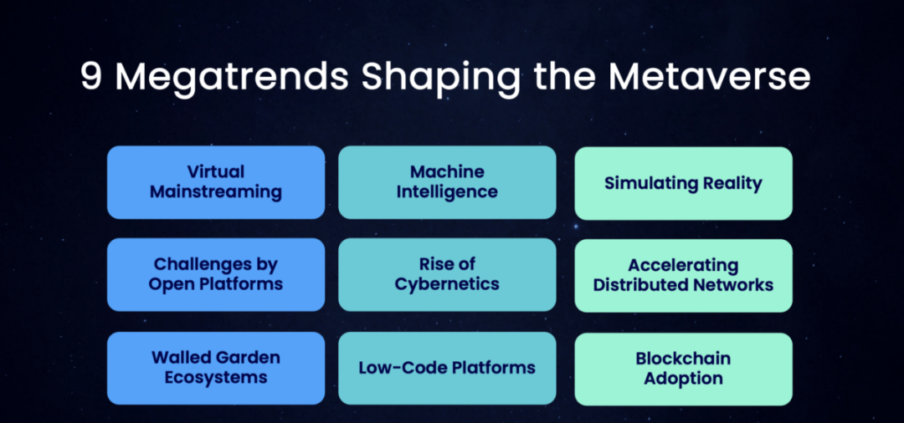
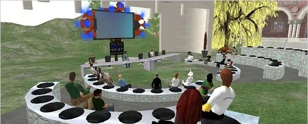

近来，元宇宙成为科技资本圈热门话题。

Facebook 10月中旬宣布，计划在未来5年，在欧盟境内雇佣1万人，来建立“元宇宙”（metaverse)。

Facebook 老板扎克伯格之前就曾表示过，他打算将这家社群媒体巨头转型为一家“元宇宙”公司。

腾讯和字节跳动等国内头部企业纷纷进入相关领域，国外脸书、微软、英伟达等科技公司也均已布局。

11月5日，罗永浩在微博中称：“我们的下一个创业项目是一家所谓的‘元宇宙’公司”。旋即，迅速在微博及其他社交平台掀起了一股讨论热潮。

有不少人士认为，元宇宙作为虚拟世界和现实世界融合的载体，蕴含社交、内容、游戏、办公等场景变革的巨大机遇。

元宇宙到底是什么？

元宇宙，没听说过，是什么玩意？自留地君一头雾水～！

先看维基百科上对元宇宙的解释吧！

> 元宇宙（英语：Metaverse），或称为后设宇宙、形上宇宙、元界、超感空间、虚空间，被用来描述一个未来持久化和未中心化的在线三维虚拟环境。此虚拟环境将可以通过虚拟现实眼镜、增强现实眼镜、手机、个人电脑和游戏机进入人造的虚拟世界。元宇宙在电脑游戏、商业、教育、零售和房地产领域都有明确的用例。大规模采用元宇宙的最大限制来自于目前与实时虚拟环境交互所需的设备和传感器的技术限制。许多公司，如Meta、机器砖块、Epic Games和微软，正在投资于元宇宙相关技术的研究，以使其更具成本效益和更广泛地使用。信息隐私和用户成瘾是元宇宙的关注，源于目前社交媒体和电脑游戏行业整体面临的问题。
>
> 维基百科词条，元宇宙

有人解释说，元宇宙，人们可以把它想象成互联网上的空间，或者，它至少以 3D 形式呈现。扎克伯格将元宇宙描述为一个你可以进入的“虚拟环境”——而不仅仅是在屏幕上看。

从本质上讲，元宇宙是一个由无尽的、相互关联的虚拟社区组成的世界，人们可以在这里见面、工作和玩耍，使用虚拟现实耳机、增强现实眼镜、智能手机应用程序或其他设备。

元宇宙是利用数字技术（包括增强现实和虚拟现实等）构筑的一个和客观世界平行的世界。

元宇宙早就有了

看了网络上的一些介绍，嗨！这被称之为元宇宙，不就是2003年 Linden Lab 所创建的第二人生（Second Life）吗？

Linden Lab 成立于 1999 年，总部位于旧金山，在西雅图、波士顿、戴维斯和夏洛茨维尔设有办事处。

2003 年，Linden Lab 推出了“第二人生”，这是一个开创性的虚拟世界，数百万人享受过，在其经济中的用户之间进行了数十亿美元的交易。

元宇宙这个词源于 1992 年尼尔·斯蒂芬森的《雪崩》，这本书描述了一个平行于现实世界的虚拟世界，Metaverse，所有现实生活中的人都有一个网络分身 Avatar。

2003年，Linden Lab创始人菲利普·罗斯达尔(Philip Rosedale)就是受到尼尔·斯蒂芬森的启发，创建了第二人生。2010年，菲利普·罗斯达尔辞去林登实验室(Linden Lab)首席执行官职务。

2005年，许晖创办HiPiHi网络虚拟生活平台，这个3D虚拟世界被人们视为中国的虚拟人生平台。

第二人生（Second Life）不就是一个已经存在了近二十年的元宇宙吗？

元宇宙发端于3D虚拟游戏，成形于三维虚拟世界。起初以游戏为核心目标，后演变为虚拟社交平台，进而成为一个和现实世界并行的，由现实世界的人们操控的虚拟的“世界”。

Linden Lab 官网首页截图

元宇宙有啥应用前景？

人们认为元宇宙有许多应用的可能性。

一个理想的元宇宙将允许用户从一个单一的起点进行任何体验或活动，或者解决他们几乎所有的需求，所以，在其完成的状态下，元宇宙可以应用于任何事物。

在商业领域，元宇宙可以用于虚拟办公平台，用户可以在模拟办公环境的3D宇宙中进行虚拟协作。

在教育领域，元宇宙可以被用来在任何地方和任何历史点进行实地考察。

在房地产领域，元宇宙可用于拟真的虚拟房屋参观。购房者将可以在自己家里通过元宇宙参观位于世界任何地方的房屋。

Second Life中的远程教学

图片源自Second Life，特别鸣谢！

人们完全可以将元宇宙想像成虚拟现实，或者大型的多人线上游戏，但没有任何限制。大部分人在元宇宙里面会有一个代表自己的3D化身，你通过这个化身在元宇宙里面从事各种活动。

在元宇宙，人们可以工作、和朋友相聚、看演唱会、看电影、或者只是在里面逛逛看看也可以，也可以玩游戏、交谈、购物、散步、聊天、看电影、经商、参加音乐会、开展教学、以及做任何他们在现实生活中可以做的事情。它就是一个和现实世界并行的虚拟世界。

元构成宇宙的9大技术趋势

Jon Radoff

按照扎克伯格的设想，在元宇宙，人们将通过虚拟替身工作、娱乐、社交，以及最重要的——消费。它既是未来主义，又是幻想主义。

2021年，英伟达公司正在开发一个名为Omniverse的元宇宙基础设施项目，该项目将允许世界各地的开发者实时合作，创建元宇宙内容创作软件。

Together Labs公司也在研究创造逼真化身的技术，它将可以利用人工智能使历史人物仿似复活。

元宇宙都是游戏吗？不是的，虽然关于元宇宙有很多不同的想法，但是，大部分人认同这样一个观点，人与人的社交互动是元宇宙概念核心。

例如，Facebook就在测试一个名为 Workplace 的虚拟现实会议程序，一个名为 Horizons 的社交空间，以及之前自留地君曾推介过的，[Virbela虚拟工作/会议空间]，三者都使用他们的虚拟化身系统。